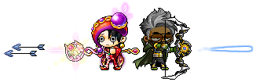
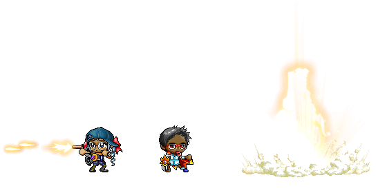
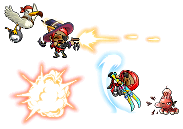

# Introducción A Los _Odd Jobs_

En MapleStory, cada personaje se construye a cierta manera. El jugador tiene
que eligir cuales progresos de clase hace, como adjudicar su AP, como adjudicar
su SP, y que equipo usar en batalla. El jugador tiene la libertad en hacer lo
que quiera y jugar como quiera, siempre que no infrinja ninguna de las reglas
del juego. Sin embargo, el juego naturalmente recomienda que los jugadores
hagan sus decisiones en una de las pocas maneras limitadas.

A pesar de las recomendaciónes del juego, los jugadores de MapleStory siempre
han encontrado maneras creativas y interesantes de violar estas normas. En
muchos casos, estas violaciones tienen su propio tipo de estructura — una
cierta lógica. Tanto es así, que a menudo consideramos estas extrañas
construcciones de personajes como “_jobs_” (clases/empleos) por derecho propio.
Estos llamados “_odd jobs_” son el tema de esta breve guía introductoria.

Esta guía ofrece un breve resumen de los _odd jobs_ más importantes y más
comunes. Para una lista más detallada, puedes examinar [la lista de _odd jobs_
en el sitio web de **Oddjobs**](https://oddjobs.codeberg.page/odd-jobs.html).
Esta guía tampoco cubre los _odd jobs_ extraños que son exclusivos a MapleStory
después del Big-Bang.

Glosario de algunos términos que estan usado dentro de esta guía

- **Ataque-básico:** El tipo de ataque melee más básico (inglés:
  _basic-attack_), que está conectado a la tecla <kbd>Ctrl</kbd> por omisión.
- **WATK:** Ataque de arma, como una estadística (inglés: “_**w**eapon
  **at**tac**k**_”).
- **MATK:** Ataque mágico, como una estadística (inglés: “_**m**agic
  **at**tac**k**_”).
- **TMA:** Ataque mágico total (MATK total).
- **WACC:** Precisión de arma (inglés: _**w**eapon **acc**uracy_).
- **MACC:** Precisión mágica (inglés: _**m**agic **acc**uracy_).
- **WDEF:** Defensa de arma (inglés: _**w**eapon **def**ence_).
- **MDEF:** Defensa mágica (inglés: _**m**agic **def**ence_).
- **MAXHP:** HP máximo.
- **MAXMP:** MP máximo.
- **DPS:** Daño por segundo (daño/s).
- **F/P:** (Mago de) fuego/ponzoña.
- **I/L:** (Mago de) hielo/rayo (_ice/lightning_).
- **CB:** Jefe de bandidos (inglés: _chief bandit_).
- **Crit(s):** Impactos críticos.

## 🔰 Novatos (inglés: _beginners_)

### Isleño (inglés: _islander_)

Isleños, como la mayoría de personajes, salen del Campamento de Entrenamiento.
¡Pero nunca salen de Isla Maple! Como resultado, necesariamente son novatos
(inglés: _beginners_) permanentes, y tienen un conjunto muy limitado de
monstruos contra los que pueden luchar. DEX quizás la estadística más
importante para los isleños, ya que mejora su daño mínimo por golpe, así
acercandolos a matar los monstruos de Isla Maple con solo uno ataque.

Debido a que Isla Maple está totalmente aislada del resto del Mundo Maple, los
isleños tienen una colección muy única de equipo y rollos (pergaminos mágicos)
que pueden usar. Por lo tanto, eventos especiales son más importantes para
isleños que para otros personajes, porque eventos especiales ofrecen a
posibilidad de obtener objetos especiales que no se dan de forma natural.

Aunque ellos tal vez parecen muy limitados a primera vista, isleños dedicados
tienen la capacidad de conseguir niveles impresionantes. Tambien, ¡hay muchas
variedades!:

#### Subespecies

- **Magoisleño (inglés: _magelander_):** Solo usa el _Metal Wand_, y
  principalmente lucha con la habilidad _Three Snails_.
- **Isleño DEX (inglés: _DEXlander_):** Tiene DEX alta.
- **Isleño STR (inglés: _STRlander_):** Tiene STR alta.
- **Isleño LUK (inglés: _LUKlander_):** Tiene LUK alta, y usa garras (p\.ej. el
  _Magical Mitten_).
- **Isleño perfecto (inglés: _perfectlander_):** Tiene STR, INT, y LUK
  suficiente para equipar cualquiera arma sobre la isla (incluyendo la _Leather
  Purse_ y la _Metal Wand_).
- **Isleño híbrido (inglés: _hybridlander_):** Es un híbrido de dos o más de
  las anteriores. Híbridos de STR/DEX y de DEX/LUK son especialmente comunes.

Más información sobre el isleño

- [MrBrandini (Cacophobia), “Brandini’s Islander Guide”, 2007-11-05, _MapleTip
  Forums_.](https://forums.mapletip.com/index.php?/topic/111589-brandinis-islander-guide/)
  ([archived](https://web.archive.org/web/20180124095048/https://forums.mapletip.com/index.php?/topic/111589-brandinis-islander-guide/))
- [Migrant (Islander), “Islander’s: Islander Guide”, 2008-06-23, _MapleTip
  Forums_.](https://forums.mapletip.com/index.php?/topic/123900-islanders-islander-guide/)
  ([archived](https://web.archive.org/web/20211125164341/https://forums.mapletip.com/index.php?/topic/123900-islanders-islander-guide/))
- [Topislander, “Complete Islander Guide”, 2010-03-20,
  _BasilMarket_.](https://web.archive.org/web/20190822160827/https://www.basilmarket.com/Complete-Islander-Guide-Thread-bqpNW-1)
- [“Islander”, 2011-11-27, _MapleWiki_.](https://web.archive.org/web/20120418085300/https://maplewiki.net/index.php?title=Islander)
- [Mooshy, “Islander Community Rankings / Guides”, 2014-12-08, _MapleRoyals
  Forums_.](https://mapleroyals.com/forum/threads/islander-community-rankings-guides.17081/)
  ([archived](https://web.archive.org/web/20201230115238/https://mapleroyals.com/forum/threads/islander-community-rankings-guides.17081/))
- [IslandSlut, “Islander Community Thread”, 2015-09-28, _MapleLegends Forums_.](https://forum.maplelegends.com/index.php?threads/islander-community-thread.5922/)
  ([archived](https://web.archive.org/web/20201230122138/https://forum.maplelegends.com/index.php?threads/islander-community-thread.5922/))

### Campista (inglés: _camper_)

Los campistas, al igual que los isleños, están limitados por su ubicación. Pero
a diferencia de los isleños, ¡nunca salen del Campo de Entrenamiento! Por lo
tanto, los campistas están muy restringidos: nunca ganan equipo y sólo se ven
obligados a luchar contra monstruos que dan 1 EXP cada uno. La mayoría de los
campistas eligen la Espada (_Sword_), ya que tiene la velocidad de ataque más
rápida de las tres armas iniciales.

Puede haber diferentes tipos de campistas, dependiendo de la versión de
MapleStory:

#### Subespecies

- **Campista clásica:** Existe en una versión más antigua, en la que el
  campamento está al aire libre y cuenta con _Tutorial Jr. Sentinels_.
- **Campista de manzana (inglés: _applelander_):** Es un campista _Adventurer_
  quien exista en una versión más reciente,  en la que el campamento está en el
  interior, obliga al jugador llevar un traje de manzana verde, y presenta las
  _Tutorial Leatties_ y los _Tutorial Drumming Rabbits_.
- **Caminante (inglés: _roadie_):** Es una campista _Cygnus Knight_, quien
  entrena a lo largo de _Empress’ Road_. Esta es la subespecie que es la más
  similar a un isleño, porque los monstruos allá dejan caer unos pocos ítems.
- **Campista de nieve (inglés: _snowlander_):** Es una campista Aran, quien
  solo lucha contra los _Tutorial Murus_.

Más información sobre el campista

- [Readers (TZD) and BigBerginner, “Readers’ Extraordinary Permanent Beginner
  Guide”, 2009-11-25, _MapleTip
  Forums_.](https://forums.mapletip.com/index.php?/topic/139169-readers-extraordinary-permanent-beginner-guide/)
  ([archived](https://web.archive.org/web/20200806122805/https://forums.mapletip.com/index.php?/topic/139169-readers-extraordinary-permanent-beginner-guide/))
- [숲속주민 \[_Supsokjumin_\] (또르르 \[_Ttoreureu_\]), “\[KMS\] 2017 Maplestory
  Camper — The last active Islander”, 2017-12-19,
  _YouTube_.](https://www.youtube.com/watch?v=s9SXRQGwvRA)

### Novato permanente (fuera de la isla) (inglés: _permabeginner (outland)_)

Aunque tanto los isleños como los campistas son necesariamente novatos
permanentes, el término “novato permanente” (inglés: _permabeginner_) a menudo
se utiliza para referirse a novatos permanentes _afuera de la isla_ (“fuera de
la isla”; inglés: _outland_). Un novato permanente tiene un Mundo Maple entero
para explorar, pero su arsenal se queda más o menos lo mismo que el de los
isleños: prácticamente solo el ataque-básico.

Como tienen acceso a un terreno más peligroso, su daño _promedio_ es más
importante para los novatos permanentes _afuera de la isla_ que para sus
homólogos de la isla, ¡y los novatos permanentes afuera de la isla pueden
alcanzar mayores cotas! Pero con el terreno peligroso, llega la constatación de
que los novatos permanentes son fuertes de corazón, pero quizá no de cuerpo.
Novatos permanentes tienen MAXHP excepcionalmente pobre (aunque benefician más
de WDEF que otras clases), y sus ataques básicos acaban siendo demasiado débil
para luchar de forma competente contra monstruos del propio nivel del novato
permanente.

Dicho esto, ¡novatos permanentes son una opción siempre popular como personaje
principal para los inclinado a _odd jobs_!. La mayoría de ellos se centran en
STR (a veces con DEX añadida, para mejorar el WACC), y tienden a usar armas de
asta, espadas y dagas. Sin embargo, novatos permanentes son al menos tan
diversos como sus homólogos isleños.

Según la versión de MapleStory, novatos permanentes (afuera de la isla) tal vez
pueden tener acceso a armas especiales que solo novatos pueden usar, p\.ej. el
_Frozen Tuna_, la _Sake Bottle_, y el muy poderoso _Maroon Mop_.

#### Subespecies

- **Novato STR (inglés: _STRginner_):** Se centra en STR. Esta es la
  subespecies más común.
- **Novato-asesino/novato LUK (inglés: _besinner_/_LUKginner_):** Se centra en
  LUK, y usa garras (p\.ej. el _Magical Mitten_).
- **Novato DEX (inglés: _DEXginner_):** Es puro DEX.
- **Novato de varita (inglés: _wandginner_):** Solo usa varitas como armas.

Más información sobre el novato permanente fuera de la isla

- [Slime (OmokTeacher), “Slime’s Comprehensive Permanent Beginner Guide”,
  2016-11-03, _MapleLegends
  Forums_.](https://forum.maplelegends.com/index.php?threads/slimes-comprehensive-permanent-beginner-guide.9513/)
  ([archived](https://web.archive.org/web/20211126061039/https://forum.maplelegends.com/index.php?threads/slimes-comprehensive-permanent-beginner-guide.9513/))
- [Readers (TZD) and BigBerginner, “Readers’ Extraordinary Permanent Beginner
  Guide”, 2009-11-25, _MapleTip
  Forums_.](https://forums.mapletip.com/index.php?/topic/139169-readers-extraordinary-permanent-beginner-guide/)
  ([archived](https://web.archive.org/web/20200806122805/https://forums.mapletip.com/index.php?/topic/139169-readers-extraordinary-permanent-beginner-guide/))
- [LittleTLK, “Comprehensive Guide to Jobless Characters Part 2”, 2010-05-13,
  _BasilMarket_.](https://web.archive.org/web/20100516173343/http://www.basilmarket.com/forum/1508788/0/Comprehensive_Guide_to_Jobless_Characters_Part_2.html)
- [DuFyy, “DuFyy’s Beginner Guide”, 2010-06-20, _MapleAnime
  Forums_.](https://www.mapleanime.com/forum/viewtopic.php?t=6216)
  ([archived](https://web.archive.org/web/20201228114125/https://www.mapleanime.com/forum/viewtopic.php?t=6216))
- [Disoriented (willekrona), “Disoriented’s Permanent Beginner Guide!”,
  2016-06-03, _MapleRoyals
  Forums_.](https://mapleroyals.com/forum/threads/disorienteds-permanent-beginner-guide.67505/)
  ([archived](https://web.archive.org/web/20210101091315/https://mapleroyals.com/forum/threads/disorienteds-permanent-beginner-guide.67505/))

## ⚔️ Guerreros

### Guerrero permanente

Los guerreros permanentes (también conocidos como _permasword(wo)men_) son uno
de los cinco tipos de perma-primeros trabajos (“perma-primeros”; inglés:
_perma-firsts_). Los perma-guerreros ascienden al trabajo de
guerrero/espadachín, pero nunca avanzan más allá de este punto. Esto hace que
los perma-primeros se parezcan a novatos permanentes, en el sentido de que se
definen por su niegamiento a avanzar de trabajo.

Los guerreros permanentes utilizan _Power Strike_ y _Slash Blast_
offensivamente y _MaxHP Increase_ y _Iron Body_ como habilidades defensivas.
Esto los hace bastante versátiles, aunque son lentos debido a la falta de
habilidades de movilidad y ataques a distancia.

Quizás el aspecto más notable del guerrero permanente es la gran variedad de
equipo que son capaces de utilizar. No sólo tienen acceso a todos los equipos
exclusivos de los guerreros ordinarios, sino que también son mucho menos
exigentes en cuanto a los tipos de armas. Ellos pueden utilizar astas, espadas,
hachas, armas contundentes e incluso dagas. Todas estas armas son muy viables
para el guerrero permanente.

### HP guerreros

Los HP guerreros (también conocidos como “guerreros de sangre”) son guerreros
sin puntos de habilidad. Ellos ponen todo de su AP en MAXHP. Un guerrero HP
sólo añade suficiente STR para avanzar en el trabajo, y luego espera hasta que
tenga el máximo en la habilidad _Improved MaxHP Increase_, antes de aumentar
todo su AP en MAXHP. Esto hace que los guerreros HP son _increíblemente_
duraderos y pueden alcanzar el tope de ¡30k MAXHP en torno al nivel 90-100!

La principal herramienta en el arsenal del guerrero HP normalmente es _Power
Guard_. Cada vez que el guerrero de HP toca a un enemigo, una parte del daño
que recibe es reflectado y daña al enemigo. Esto es a menudo ineficiente, pero
significa que los HP guerreros pueden luchar contra casi cualquier enemigo
cuando son de nivel ≈41 más o menos. También significa que los guerreros de HP
suelen ir por la ruta del luchador (_fighter_) o del paje (_page_) cuanda
avanzan en su segundo trabajo (los/las lanceros/as (inglés: _spear(wo)men_)
nunca consiguen la Guardia de Poder). Para maximizar el daño de _Power Guard_,
el guerrero HP busca bajar su WDEF tanto como sea posible. Para ellos, el
debuff de la habilidad _Rage_ puede ser útil (además de ser útil para el
grupo).

En raras ocasiones, los guerreros de HP pueden optar por la routa de lanceros
(_spear(wo)men_) para dar apoyo a su grupo. Mientras están en un nivel bajo,
puedes hacer uso de las habilidades _Hyper Body_ e _Iron Will_.

Más información sobre el HP guerrero

- [ShurikenRonan, “A Guide for an HP Warrior!”, 2006-05-07, _Sleepywood
  Forums_.](https://web.archive.org/web/20120614133139/http://sleepywood.net/forum/showthread.php?t=891610)
- [Chippage, “The Complete HP Warrior guide from Levels 1–30”, 2008-06-27,
  _MapleTip
  Forums_.](https://forums.mapletip.com/index.php?/topic/124215-the-complete-hp-warrior-guide-from-levels-1-30/)
  ([archived](https://web.archive.org/web/20140708143118/https://forums.mapletip.com/index.php?/topic/124215-the-complete-hp-warrior-guide-from-levels-1-30/))

### Guerrero de la daga

Los guerreros que utilizan exclusivamente dagas como arma se conocen como
guerreros de la daga. Las “dagas de STR” — dagas que requieren una cantidad
significativa de STR y DEX para ser equipadas — son populares entre los
bandidos ordinarios, pero en realidad no son exclusivas a los ladrones (inglés:
_thieves_). ¡Esas armas son exclusivas a ladrones _y_ a guerreros! Porque estas
dagas de ladrón-guerrero _sólo_ requieren STR y DEX para ser equipadas (es
decir, no requieren LUK), fomentan naturalmente la creación de guerreros con
daga.

Al igual a los guerreros permanentes, los guerreros de la daga tienen que usar
_Power Strike_ y _Slash Blast_ por vida. Sin embargo, a diferencia a los
perma-guerreros, los guerreros de la daga pueden avancar de segundo trabajo (y
despues de eso, tercero y cuarto). Más adelante, esto les da muchas
herramientas de uso. Las más notables son: _Rage_, _Threaten_, _Hyper Body_,
_Berserk_, _Shout_, _Shield Mastery_, y sobre todo, ¡_Combo Attack_! Esto hace
que luchador (_fighter_) → cruzado (_crusader_) → héroe (_hero_) es la
progresión de clase de guerreros de la daga mas usada. Aunque otros caminos
tienen sus ventajas también. Tengan en cuenta que los guerreros con daga no
pueden utilizar Rugido del Dragón (_Dragon Roar_).

Cuando se construye a manera “normal” — es decir, con suficiente DEX para
equipar su arma, y el AP restante en STR — los guerreros con daga son unos de
los más poderosos “_odd jobs_” en términos de DPS.

#### Especies relacionadas

- **Guerrero de la varita:** Utiliza exclusivamente varitas, en lugar de dagas.

### DEX guerrero

Guerreros que vuelcan todos sus AP (excepto los 35 STR de base necesarios para
avanzar en el trabajo) son conocidos como guerreros de DEX. Aunque los
guerreros de DEX infligen menos daño que guerreros “normales”, son capaces de
utilizar el mismo conjunto de habilidades, y su extrema agilidad viene con sus
propias ventajas.

Los DEX guerreros son famosos por su precisión divina y su increíblemente
estabilidad de daño. También tienen mucha más capacidad de evasión
(_avoidability_) que los guerreros basados en STR, y no tienen problemas para
blandir la legendaria Espada Diente de Piedra (_Stonetooth Sword_). DEX
contribuye a la magnitud del daño del guerrero — esto, combinado con los
arsenales proporcionados por las distintas clases de guerreros, hace que los
guerreros con DEX son unos de los mas potentes “_odd jobs_” en general.

Debido a que no tienen STR, los DEX guerreros tienen consideraciones únicas en
cuanto a su equipo. Esto a menudo hace que el equipo de los DEX guerreros se
parezca más al equipo de los novatos permanentes que al equipo de guerreros
ordinarios.

#### Especies relacionadas

- **LUK guerrero:** Es pura LUK, en lugar de pura DEX. Los guerreros de LUK
  renuncian a algo de daño, estabilidad de daño, y WACC, a cambio de más
  capacidad de evasión (_avoidability_), y mas DPS con garras.

## 🧙 Magos

### Magos permanentes

Los magos permanentes son uno de los cinco tipos de perma-primeros trabajos
(“perma-primeros”; inglés: _perma-firsts_). Los perma-magos ascienden al
trabajo de mago, pero nunca avanzan más allá de este punto. Esto hace que los
perma-primeros se parezcan a novatos permanentes, en el sentido de que se
definen por su niegamiento a avanzar de trabajo.

Magos permanentes confían en la habilidad _Magic Claw_ (y _Energy Bolt_) para
atacar, y usan los hechizos defensivos como _Magic Guard_, _Magic Armor_, e
_Improved MaxMP Increase_. Esto hace que los permamagos son bastante
resistentes, pero carecen la capacidad de atacar a varios enemigos al mismo
tiempo. Los permamagos también pueden ser lentos, ya que sus ataques tienen
cierto alcance, pero carecen del _Teleport_ de otros magos.

Los permamagos son totalmente neutrales en cuanto a elementos, a diferencia de
otros tipos de magos hechiceros.

### Mago de la fuerza (inglés: _STR mage_)

, un clérigo de la fuerza (STR cleric)")

Un mago que dedica su AP a STR (y posiblemente algo de DEX, para el WACC) es
conocido como un mago de la fuerza (inglés: _STR mage_), o mago STR. El
principal modo de combate de un mago STR es el cuerpo a cuerpo; infligen daño
al medio de ataques-básicos, al igual que los novatos permanentes.

Sin embargo, a diferencia de los novatos permanentes, los magos de la fuerza
tienen una gran variedad de hechizos y otros recursos a su disposición. Los
magos STR son mucho más resistentes que los que los novatos, gracias a sus
habilidades _Magic Guard_, _Magic Armor_, etc. También tienen, suponiendo que
no sean permamagos, disposición ha su habilidad _Teleport_, que les permite
atacar a sus enemigos durante el movimiente de _Teleport_ (“_teleslash_”).
También tienen acceso a armas como por ejemplo el _Fusion Mace_, que son
diseñadas specificadamente para los magos STR.

Normalmente, los magos de la fuerza siguen uno de los dos caminos: clérigo
(_cleric_) → sacerdote (_priest_) → obispo (_bishop_), o del mago fuego/veneno
(_fire/poison_). Como obispo, el mago STR es increíblemente duradero, a la vez
que puede usar una cantidad masiva de utilidades. Desde la habilida _Heal_ (los
magos STR sólo utilizan esta habilidad defensivamente), a _Bless_, _Holy
Symbol_, _Doom_, _Dispel_, hasta _Resurrection_, y muchos más. El obispo STR
siempre tiene algo que aportar. Y el mago de fuego/veneno tiene hechizos como
_Slow_, _Seal_, y el más importante: _Poison Mist_. La nube persistente de
Niebla Venenosa (_Poison Mist_) ignora el MACC del mago de fuego/veneno de STR
(_F/P STR mage_), permitiéndole envenenar a cualquier monstruo que no sea un
monstruo-jefe (_boss monster_).

Aunque son mucho menos populares, los magos de hielo/rayo (_STR I/L mages_) y
los permamagos de la fuerza (_STR permamagicians_) también son posibles.

#### Especies relacionadas

- **DEX mago:** Es pura DEX, pero por lo demás funciona como un mago STR.

Más información sobre el mago de la fuerza (mago STR)

- [deer (cervid), “The Divinely Blessed Knight-Errant, The Holy Physician
  Turned Armed Zealot: The STR Cleric”, 2020-10-30,
  _Oddjobs_.](https://oddjobs.codeberg.page/guides/str-cleric/)
  ([mirror](https://oddjobs-maple.github.io/guides/str-cleric/))
- [Hyperhal (GreenMidori), “STR Mage v3”, 2007-03-04, _Hidden Street
  Forums_.](https://www.hidden-street.net/forum/threads/14161-STR-Mage-v3)
  ([archived](https://web.archive.org/web/20201228092416/https://www.hidden-street.net/forum/threads/14161-STR-Mage-v3))
- [scan-9, “War mage (STR Mage) Guide”, 2007-12-05, _MapleTip
  Forums_.](https://forums.mapletip.com/index.php?/topic/113500-war-mage-str-mage-guide/)
  ([archived](https://web.archive.org/web/20140708111804/https://forums.mapletip.com/index.php?/topic/113500-war-mage-str-mage-guide/))

### Maguito (inglés: _magelet_)

Un mago con puro LUK se llama maguito (inglés: _magelet_). Una forma de pensar
sobre los maguitos es que los magos STR son para los _STRginners_, como los
maguitos son para los _LUKginners_. Y de hecho, el maguito es experto en el uso
de garras. Sin embargo, quizás el rasgo más importante de los maguitos es que
¡tienen el mismo MACC que sus contrapartes “normales”! Esto permite a los
maguitos hacer uso de todas sus habilidades.

Aunque los maguitos pueden infligir menos daño que sus contrapartes cuando usan
hechizos, los maguitos sobresalen en evasión (_avoidability_), DPS con garras,
y WACC (útil para terminar sus enemigos (inglés: _last-hitting_) cuando
entrenan con _Poison Mist_). También tienen algunas opciones especiales de
equipo, ya que hay varias armas orientadas a la TMA que tienen requisitos
significativos de LUK, pero no de INT.

Los maguitos pueden prosperar en cualquiera de los tres caminos principales de
los magos (fuego/veneno, hielo/rayo, clérigo/sacerdote/obispo). Los maguitos de
fuego/veneno benefician del hecho de que efectos de veneno (de _Poison Breath_,
_Poison Mist_, _Element Composition_) ignoran la TMA del mago. Los magos
hielo/rayo benefician del fuerte control de masas (inglés: _crowd control_) y
del DPS bruto de las habilidades hielo/rayo. Y, por último, pero no menos
importante, los clériguitos/sacerdotecitos/obispitos benefician de el hecho de
que el daño de _Heal_ escala con LUK, así como de las increíbles habilidades de
utilidad de los obispos.

#### Subespecies

- **Mago con garras:** Es un mago quien sólo usa garras.

Más información sobre el maguito

- [deer (cervine, d33r), “Fate’s Warlock, Fortune’s Witch: The Magelet”,
  2021-01-25, _Oddjobs_.](https://oddjobs.codeberg.page/guides/magelet/)
  ([mirror](https://oddjobs-maple.github.io/guides/magelet/))

### Gish

Para algunos jugadores, los magos de STR/DEX dejan que desear — sin MACC, casi
todos los hechizos ofensivos son inútiles. Añadiendo algo de AP en LUK y/o INT,
pero añadiendo AP como un mago STR/DEX, el gish es capaz de aprovechar ambos
mundos: físico _y_ mágico. El gish está en una posición única para hacer un
buen uso de los objetos especiales que tienen beneficios físicos y mágicos,
como los paraguas (inglés: _umbrellas_), el _Crimson Arcglaive_, el
_Flamekeeper Cordon_, el _Kebob_, la Katana Flamígera (inglés: _Flaming
Katana_), etc.

Los gishes deben sacrificar parte del poder cuerpo a cuerpo del mago STR/DEX
para para poder dominar los ataques mágicos. Además, los gishes son
extremadamente únicos en su dependencia de cada una de las estadísticas: ¡STR,
DEX, INT, _y_ LUK! Estos dos hechos combinados hacen que el gish sea uno de los
trabajos más difíciles de MapleStory de jugar correctamente. La asignación de
AP y la elección de equipo para un gish no es para los débiles de corazón y
tambien pueden occurar problemas de MACC (y algunos problemas de WACC).

Sin embargo, para aquellos que estén dispuestos a aceptar el reto, los gishes
pueden ser increíblemente gratificante. No sólo son atacantes mixtos, sino
tambien son capaces de alternar entre modos de combate sin cambiar de equipo.
Además, al igual que los maguitos, los gishes pueden sobresalir en cualquiera
de las tres vías principales de los magos.

#### Subespecies

- **Gishlet:** Es un gish sin INT, focusandose sólo en STR/DEX y LUK.

Más información sobre el gish

- [cortical (GishGallop), “Project Gish”, 2021-03-16, _Oddjobs
  Forum_.](https://oddjobs.flarum.cloud/d/11-project-gish)
  ([archived](https://web.archive.org/web/20211126122154/https://oddjobs.flarum.cloud/d/11-project-gish))
- [Hyperhal (GreenMidori), “STR Mage v3”, 2007-03-04, _Hidden Street
  Forums_.](https://www.hidden-street.net/forum/threads/14161-STR-Mage-v3)
  ([archived](https://web.archive.org/web/20201228092416/https://www.hidden-street.net/forum/threads/14161-STR-Mage-v3))
- [deer and cortical (GishGallop), “Gish AP Calculator”, 2021-04-21,
  _Oddjobs_.](https://oddjobs.codeberg.page/gish-ap-calc/)
  ([mirror](https://oddjobs-maple.github.io/gish-ap-calc/))

## 🏹 Arqueros

### Arquero permanente

Los arqueros permanentes son uno de los cinco tipos de perma-primeros trabajos
(“perma-primeros”; inglés: _perma-firsts_). Los perma-arqueros ascienden al
trabajo arquero, pero nunca avanzan más allá de este punto. Esto hace que los
perma-primeros se parezcan a novatos permanentes, en el sentido de que se
definen por su niegamiento a avanzar de trabajo.

Los perma-arqueros confían en la combinación de _Critical Shot_ con _Double
Shot_ (y/o _Arrow Blow_) en uso offensivo. Por otro lado, carecen casi por
completo de defensas (excepto por los +20 de evasión (_avoidability_) de
_Focus_) — ni siquiera obtienen el aumento de MAXHP al tomar el segundo avance
de trabajo. Esto hace que los arqueros permanentes son muy frágiles, e
incapaces de golpear a más de un monstruo a la vez. Sin embargo, los
permarqueros son tan “a distancia” como cualquier otro arquero, y su DPS de un
solo objetivo es muy impresionante para un trabajo extraño.

Los permarqueros destacan por ser igual de hábiles en el uso de arcos y de
ballestas. Si todo lo demás es igual, las ballestas tienden a ser ligeramente
más potentes que los arcos.

### Mujer/hombre del bosque

Un arquero que es puro STR se llama mujer/hombre del bosque (inglés:
_woods(wo)man_), o leñador. Con todo ese STR, lxs mujeres/hombres del bosque
son muy competentes en el ataque básico, como los novatos permanentes STR
(inglés: _STRginners_) y los magos STR. Por otro lado, sus habilidades arqueras
siguen siendo formidable, lo que contribuye a su versatilidad.

En el combate cuerpo a cuerpo, la/el mujer/hombre del bosque beneficia de
varias cosas:

- Acceso a armas especiales para “novatos con trabajo” (inglés: “_jobbed
  beginners_”), como la _Monkey Wrench_ y el _Metal Axe_;
- invocaciones, como _Silver Hawk_ y _Frostprey_;
- y una serie de potenciadores (inglés: _buffs_), como _Sharp Eyes_, _The
  Blessing of Amazon_, _Focus_, etc.

En el tiro con arco, la/el mujer/hombre del bosque beneficia de muchas de las
mismas cosas que un que un arquero “normal”. Sin embargo, hay algunas
diferencias cruciales:

- La/el mujer/hombre del bosque tiene dificultades para usar el equipo de
  arquero ordinario, debido a su falta de DEX. Las armas maple (_Maple
  weapons_) (p\.ej. _Maple Nishada_) son extremadamente útiles en este caso,
  así como el _Bow of Magical Destruction_. Por lo demás, el equipo de leñador
  es es muy similar al equipo del novato permanente STR.
- El daño del leñador es naturalmente más bajo, pero también más estable.
- La/el mujer/hombre del bosque tiene que encontrar una manera de compensar su
  falta de WACC.

Con su versatilidad, y su capacidad de utilizar cualquier habilidad arquera a
su disposición, lxs mujeres/hombres del bosque son excepcionalmente fuertes
(para un _odd job_) en la mayoría de situaciones. Su principal debilidad es,
por supuesto, su fragilidad, aunque suelen ser más resistentes que los
perma-arqueros y los novatos permanentes en este aspecto. Lxs mujeres/hombres
del bosque también están en desventaja con respecto a los gishes, ya que deben
cambiar de equipo para cambiar su estilo de combate.

Tanto los usuarios de arcos como los de ballestas son mujeres/hombres del
bosque fuertes. Algunos afirman que los usuarios de ballesta son superiores,
debido a su acceso a _Snipe_, pero ambos tienen sus puntos fuertes.

Más información sobre la/el mujer/hombre del bosque

- [deer (capreolina), “The Martial Classicist, The Strongest Drawing Arm In All
  The Land: The Woodsman”, 2020-12-07,
  _Oddjobs_.](https://oddjobs.codeberg.page/guides/woodsman/)
  ([mirror](https://oddjobs-maple.github.io/guides/woodsman/))

### _Bow-whacker_

Los _bow-whackers_ son arqueros que utilizan arcos or ballestas, pero no pueden
disparar flechas ni utilizar _Soul Arrow_. En su lugar, golpean a los monstruos
utilizando el _Power Knock-Back_ (PKB). La estadística principal de PKB es DEX,
y su estadística secundaria es STR. Los _bow-whackers_ tienden a tener la misma
estructura de AP que un arquero “normal”.

Desafortunadamente, la maestría de PKB no se puede aumentar con otras
habilidades como _Bow Mastery_. Y, las fuentes pasivas de críticos (p\.ej.
_Critical Shot_) no funcionan con los golpes de arco (inglés: _bow-whacks_).
Sin embargo, son capaces de infligir una cantidad razonable de daño. Además, el
PKB golpea hasta seis monstruos a la vez, lo que los hace eficaz para matar a
multitudes de monstruos en muchas situaciones. Los _bow-whackers_ por lo demás
benefician normalmente de las otras habilidades de arqueros, como las
invocaciones y los _buffs_ (¡incluso _Sharp Eyes_!).

## 🥷 Ladrones

### Pícaro permanente

Los pícaros permanentes son uno de los cinco tipos de perma-primeros trabajos
(“perma-primeros”; inglés: _perma-firsts_). Los perma-pícaros ascienden al
trabajo de pícaro, pero nunca avanzan más allá de este punto. Esto hace que los
perma-primeros se parezcan a novatos permanentes, en el sentido de que se
definen por su niegamiento a avanzar de trabajo.

Los perma-pícaros son atacantes mixtos de cuerpo-a-cuerpo/a-distancia
(_melee_/_ranged_), porque pueden usar dagas en combinación con _Double Stab_,
así como garras en combinación con _Lucky Seven_.

Debido a la maestría incorporada de _Lucky Seven_ y a la fórmula de daño
generalmente favorable, los perma-pícaros son tal vez los perma-primeros más
fuertes en términos de DPS a un solo objetivo (inglés: _single-target DPS_).
Aunque carecen _Haste_, son un poco mas móviles que los perma-arqueros porque
pueden atacar en el aire. Sin embargo, al igual que los perma-arqueros, son muy
fragiles porque no obtienen una bonificación de MAXHP por no avancar al segundo
trabajo, y sólo les queda la capacidad de 20 evasión (_avoidability_) de la
habilidad _Nimble Body_.

### Bandolero (inglés: _brigand_)

Un bandido/CB/_shadower_ quien no usa dagas, y no tiene LUK, se llama bandolero
(inglés: _brigand_), o hombre/mujer de la carretera (inglés: _highway(wo)man_).
Los bandoleros se juegan normalmente de forma similar a los novatos permanentes
STR (_STRginners_), centrándose en STR, y utilizando armas de asta y espadas.

Sin embargo, a diferencia de los novatos permanentes, los bandoleros obtienen
algunas ventajas especiales:

- Acceso a armas especiales para “novatos con trabajo” (inglés: “_jobbed
  beginners_”), como _Monkey Wrench_ y _Metal Axe_;
- habilidades de ataque especiales como _Disorder_, _Steal_, y tambien _Meso
  Explosion_;
- y una serie de potenciadores, _Dark Sight_, _Haste_, _Meso Guard_, etc.

Como resultado de una mayor potencia máxima natural (MAXHP) y el beneficio de
_Meso Guard_, los bandoleros son mucho más resistentes que los novatos
permanentes.

#### Especies relacionadas

- **_Grim reaper_:** Es cualquier trabajo que utilice exclusivamente la guadaña
  (_Scythe_).
- **Carpintero (inglés: _carpenter_):** Es cualquier trabajo que utiliza
  exclusivamente la sierra (_Saw_).

Más información sobre los bandoleros/brigands

- [OresPlz (binomine), “Guide to Perma Beginners”, 2009-12-28, _Maplestory
  Mesos Guide
  Blogger_.](https://maplestorymesos2009.blogspot.com/2009/12/guide-to-perma-beginners.html)
  ([archived](https://web.archive.org/web/20210103204521/https://maplestorymesos2009.blogspot.com/2009/12/guide-to-perma-beginners.html))
- [DrakeCalvin, “Okay, could someone tell me where a brigand should grind?”,
  2010-11-23,
  _BasilMarket_.](https://web.archive.org/web/20200221183446/https://www.basilmarket.com/Okay-could-someone-tell-me-where-a-brigand-should-grind-Thread-bwkbz-1)

### Asesino sin LUK

Los asesinos sin LUK son asesinos (_assassins_)/ermitaños (_hermits_)/señores
de la noche (_nightlords_) que no tienen LUK, añadiendo su AP en STR/DEX en
lugar de LUK. Esto hace que el asesino sin LUK sea similar al bandolero
(_brigand_), pero tomando el otro camino principal de los ladrones. Como
resultado, los asesinos sin LUK se juegan a menudo de forma similar a los
novatos de STR (_STRginners_).

Al igual que los bandoleros, asesinos sin LUK tienen acceso a las armas de los
“novatos con trabajo” (inglés: _jobbed beginners_), a la habilidad _Disorder_ y
potenciadores como _Dark Sight_ y _Haste_. Sin embargo, incluso en el cuerpo a
cuerpo, los asesinos sin LUK se diferencian de los bandoleros:

- Asesinos sin LUK obtienen _Flash Jump_, pero no obtienen _Steal_ ni _Meso
  Explosion_.
- Asesinos sin LUK obtienen bonificaciones únicas, como _Meso Up_ y
  _Alchemist_.
- Asesinos sin LUK son más frágiles, ya que no tienen acceso a _Meso Guard_.

Sin embargo, los asesinos sin LUK no sólo son conocidos por su destreza en el
cuerpo a cuerpo; son perfectamente hábiles con las garras, también. Tanto STR
como DEX contribuyen al daño con garras (exceptuando _Lucky Seven_, _Triple
Throw_, y _Shadow Meso_), lo que hace que su uso de garras sea similar a la/al
mujer/hombre del bosque cuando usan ballestas o arcos. Ten en cuenta que esta
similitud se aplica a la elección del arma; el asesinos sin LUK suele usar
garras de Maple y _Shinobi Bracers_, etc.

En el primer trabajo, el uso de las garras se limita a los ataques-básicos. En
el segundo trabajo, _Drain_ se convierte en una habilidad de ataque efectiva, y
también obtienen acceso a _Claw Mastery_, _Critical Throw_, y _Claw Booster_.
En el tercer trabajo, _Avenger_ y _Shadow Meso_ son habilidades de ataque muy
efectivas: la primera para atacar múltiples enemigos (inglés: _mobbing_), y la
segunda para un solo objetivo. _Shadow Meso_ es único porque ignora todas las
estadísticas (STR, DEX, LUK, WATK, etc.), e ignora _Claw Mastery_ y _Critical
Throw_. Aunque esto significa que _Shadow Meso_ no puede mejorar una vez que
está en el nivel máximo, también es el secreto para que los ermitaños sin LUK
sean uno de los odd-jobs más poderosos con respecto DPS de un solo objetivo.
También obtienen _Shadow Partner_ en este punto, aumentando aún más su daño con
las garras.

#### Subespecies y especies relacionadas

- **STR (ase)sino/STRmit/STRlord:** Es un asesino sin LUK con más STR que DEX.
- **DEX (ase)sino/DEXmit/DEXlord:** Es un asesino sin LUK con más DEX que STR.
- **_Grim reaper_:** Es cualquier trabajo que utilice exclusivamente la guadaña
  (_Scythe_).
- **Carpintero (inglés: _carpenter_):** Es cualquier trabajo que utiliza
  exclusivamente la sierra (_Saw_).

### Bandido sin LUK

Los bandidos sin LUK (a menudo vagamente llamados “_DEXdits_”) son
bandidos/CBs/_shadowers_ que no tienen LUK, añadiendo su AP a STR/DEX en su
lugar. Esto hace que el bandido sin LUK sea similar al bandolero (_brigand_),
pero sin la restricción que les impide usar dagas. Los “_dits_ sin LUK” se
definen en parte por el uso de dagas como su arma principal.

De hecho, esto hace que el bandido sin LUK es más similar al guerrero DEX que
al bandolero/_brigand_. Al igual que el guerrero DEX, el dit sin LUK:

- Puede hacer buen uso de cualquier habilidad a la que tenga acceso.
- Tiene mucho más WACC que sus contrapartes “normales”.
- Tiene un daño increíblemente estable. De hecho, los _dits_ sin LUK suelen ser
  superiores en en este aspecto; un _dit_ sin LUK con nivel ≥19 de _Dagger
  Mastery_ hace _casi_ exactamente lo mismo daño cada vez que usa _Savage
  Blow_.

A diferencia a los guerreros con DEX, los _dits_ sin LUK no tienen más
capacidad de evasión (_avoidability_) que sus contrapartes “normales”. De
hecho, tienen menos.

Los bandidos sin LUK normalmente añaden lo suficiente de STR para equipar sus
dagas, y ponen el AP restante en DEX. STR y DEX contribuyen por igual a su
daño, y DEX aumenta el WACC y el AVOID, mientras que el STR no lo hace.

#### Subespecies

- **(Puro) _DEXdit_:** Es puro DEX; un bandido sin LUK que además no tiene STR.
  Esta subespecie tiene más dificultades para equipar dagas y escudos.

### Bandido de sangre

Los bandidos de sangre (también conocidos como “_dits_ de HP”) (inglés: _HP
dits_) son bandidos/CBs/_shadowers_ que ponen todo de su AP en MAXHP. Un “_dit_
de sangre” sólo añade suficiente DEX para avanzar en trabajo, y luego vuelca
todo su AP en MAXHP. Esto, en combinación con _Meso Guard_ del tercer trabajo,
hace a los bandidos de sangre _increíblemente_ duraderos — un dit de sangre con
_Meso Guard_ es prácticamente imposible de matar.

La principal herramienta del arsenal de los bandidos de sangre es _Meso
Explosion_. El daño de _Meso Explosion_ ignora las estadísticas del _dit_ de
sangre (STR, DEX, LUK, WATK, etc.), pero obviamente requiere explotar un montón
de dinero. Esto suele ser costoso, pero significa que bandidos de sangre pueden
luchar contra _casi cualquier_ enemigo en el momento en que son de nivel 70–80
o más o menos. También significa que el bandido de sangre tiene que esperar
otros 30–35 niveles para madurar, en comparación al guerrero HP (_HP warrior_).
Para el bandido de sangre, el camino hacia _Meso Explosion_ es largo, ¡pero
increíblemente gratificante!

Más información sobre el bandido de sangre

- [Linyah (Marty), “\[In-Depth\] Shadower Guide”, 2014-05-05, _MapleRoyals
  Forums_.](https://mapleroyals.com/forum/threads/in-depth-shadower-guide.8122/)
  ([archived](https://web.archive.org/web/20160716031114/http://mapleroyals.com:80/forum/threads/in-depth-shadower-guide.8122/))
- [Fiel, “Full Meso Explosion Formula”, 2010-06-10,
  _Southperry_.](http://www.southperry.net/showthread.php?t=27895)
  ([archived](https://web.archive.org/web/20210123231138/http://www.southperry.net/showthread.php?t=27895))

## 🏴‍☠️ Piratas

### Pirata permanente

Los piratas permanentes son uno de los cinco tipos de perma-primeros trabajos
(“perma-primeros”; inglés: _perma-firsts_). Los perma-piratas ascienden al
trabajo de pirata, pero nunca avanzan más allá de este punto. Esto hace que los
perma-primeros se parezcan a los novatos permanentes, en el sentido de que
ellos como los novatos permanentes nunca avanzan su trabajo.

Los perma-piratas son atacantes mixtos de cuerpo a cuerpo y a distancia, ya que
pueden hacer uso de _Somersault Kick_ y _Flash Fist_ para el cuerpo a cuerpo,
así como _Double Shot_ para el alcance. Sin embargo, a diferencia del
perma-pícaro, la estadística principal del pirata permanente depende de la
habilidad que esté usando: para las habilidades de cuerpo a cuerpo, es
preferible la STR; y para _Double Shot_, es preferible la DEX. Esto significa
que la mayoría de los perma piratas tienden a especializarse en el cuerpo a
cuerpo o en el alcance. También es posible tener más o menos el mismo STR y
DEX, para mezclar los dos typos de ataque.

Dado que los perma-piratas tienen ataques tanto cuerpo a cuerpo como a
distancia, así como ataques de un solo objetivo y ataques multiobjetivo, son
quizás los perma primeros (_perma-firsts_) más versátiles. Además, tanto
_Double Shot_ con DEX alta, como _Flash Fist_, con STR elevada, son muy
potentes para infligir DPS a un solo objetivo. Los piratas permanentes son
también los _perma-firsts_ más móviles, ya que tienen la habilidad _Dash_ y
todos sus ataques son utilizables en el aire. Sin embargo, al igual que los
permarqueros y perma-pícaros, son muy frágiles — no obtienen una bonificación
de MAXHP por el avance del segundo trabajo, y sólo les queda la capacidad de
evasión (_avoidability_) +20 de Tiempo de Bala (_Bullet Time_).

### DEX _brawler_/luchador

Los _brawlers_/_marauders_/_buccaneers_ que vuelcan todo su AP en DEX son
conocidos como _DEX brawlers_, o luchadores de DEX. Aunque los _DEX brawlers_
generalmente infligen mucho menos daño que homólogos sin DEX, son capaces de
utilizar el mismo conjunto de habilidades, y su extrema agilidad tiene sus
propias ventajas:

- Los _brawlers_ DEX son conocidos por su extrema capacidad de evasión. Los
  luchadores ganan un **1\.5** de evasión por cada punto de DEX\*, lo que hace
  que los luchadores de DEX sean capaces de alcanzar el tope de evasión de 999.
- Los luchadores DEX tienen el WACC más alto del juego — sí, ¡incluso más que
  los guerreros DEX!
- El daño cuerpo a cuerpo de los luchadores DEX es mucho más estable que el de
  sus homólogos sin DEX.
- Con _Double Shot_ y un pistola, los luchadores DEX son capaces de combatir a
  distancia también. Esto hace que los luchadores con DEX (y algunos _odd jobs_
  relacionadas) son los atacantes a distancia más duraderos del juego,
  incluyendo a trabajos “normales”.

Sin embargo, en comparación con el guerrero DEX, el luchador DEX carece de
tanto en supervivencia como en opciones de armas. Los luchadores son
naturalmente resistentes, pero no tanto como los guerreros. Y a diferencia del
guerrero DEX, el brawler DEX prácticamente tiene que usar armas Maple sin otras
optiones. El conjunto de habilidades del luchador tampoco no juega tan bien con
las construcciones de DEX pura, lo que significa que los guerreros de DEX a
menudo (pero _no siempre_) tiene la ventaja de DPS.

Notas a pie de página para “DEX brawler/luchador”

\*Esto no es cierto en MapleLegends, donde los
_brawlers_/_marauders_/_buccaneers_ ganan sólo 0\.25 de evasión
(_avoidability_) por punto de DEX.

#### Especies relacionadas

- **LUK brawler/LUKaneer/luccaneer/LUK bucc/lucc bucc:** Es pura LUK, en lugar
  de DEX puro.
- **_Bullet bucc_/_gun brawler_:** Es un _brawler_/_marauder_/_buccaneer_ que
  exclusivamente utiliza armas de fuego.

### Pugilista

Cualquier personaje que nunca equipa un arma se llama pugilista. Resulta que
sólo los piratas son capaces de atacar sin un arma, por lo que todos los
pugilistas son piratas. Además, atacar sin arma es — en _algunas_ formas —
similar a usar un puño de acero (inglés: _knuckler_, _\[brass\] knuckles_). Por
lo tanto, la mayoría de los pugilistas son _brawlers_/_marauders_/_buccaneers_.
Por supuesto, también son posibles los
perma-piratas/pistoleros/_outlaws_/_corsairs_.

Todas las habilidades orientadas a los pugilistas del primer, segundo, tercer,
y cuarto trabajo se pueden utilizar con las manos desnudas, con dos
excepciones: _Knuckler Mastery_ y _Knuckler Booster_. Esto significa que los
_brawlers_ pugilistas tienen una maestría (el pugilista tiene un 10% de
maestría\*), WACC, y velocidad de ataque en desventaja en comparación a sus
homólogos “normales”. Como las manos desnudas tienen la categoría de velocidad
de 4, el pugilista ya no está en desventaja de velocidad de ataque una vez que
tiene _Speed Infusion_.

La inusual fórmula de daño para atacar sin un arma equipada, combinada con la
desventaja de WATK por no tener un arma, hace que el daño del pugilista sea muy
inferior a los estándares de trabajos “normales”. Sin embargo, son bastante
poderosos en general, para los estándares de los _odd jobs_, y funcionan de
manera muy similar a un _brawler_/_marauder_/_buccaneer_ “normal”.

Notas a pie de página para “Pugilista”

\*El nivel ≥11 de _Super Transformation_ da pasivamente +5% de maestría, por lo
que un pugilista con un nivel alto de esta habilidad tiene 15% de maestría.

#### Subespecies

- **Pugilista mano vacía/pugilista sin escudo:** No utiliza escudo.
- **Pugilista con escudo:** Utiliza un escudo para compensar parte del WATK
  perdido por no llevar un arma.

### _Swashbuckler_

Un pistolero/_outlaw_/_corsair_ quien es puro STR se llama _swashbuckler_. Con
todo de esa STR, los _swashbucklers_ son muy competentes en el uso de
_Somersault Kick_. Por otro lado, sus habilidades con las armas de fuego siguen
siendo formidables, lo que contribuye a su versatilidad. Esto hace que el
_swashbuckler_ sea una “versión pirata de la/del mujer/hombre del bosque”, pero
estos dos _odd jobs_ son en realidad muy distintos.

Al igual a la/al mujer/hombre del bosque, el swashbuckler tiene dificultades
para llevar equipo pirata (_Maple Cannon Shooter_ es el arma más potente para
un _swashbuckler_). El _swashbuckler_ tiene un daño a distancia menor — pero
más estable — que sus homólogos “normales”, y tiene un WACC más bajo que sus
homólogos “normales”.

Sin embargo, en el cuerpo a cuerpo, el arma habitual del swashbuckler es una
lanza (p\.ej. _Sky Ski_), aunque los puños de acero, las espadas, y las dagas
también pueden ser bastante buenos. Esto se debe a que _Somersault Kick_
siempre “apuñala”, por lo que las armas que hacen daño al apuñalar funcionan
bien con _Somersault Kick_. Debido a que _Somersault Kick_ golpea hasta seis
monstruos a la vez, y porque los ataques pistoleros multiobjetivos del
_swashbuckler_ son mediocres, la _Somersault Kick_ con un arma cuerpo a cuerpo
es la principal método del swashbuckler para atacar múltiples enemigos.

En el cuarto trabajo, _Aerial Strike_ funciona de forma similar a _Somersault
Kick_, por lo que también típicamente se usa con una lanza. De hecho, _Aerial
Strike_ — usado por un swashbuckler con una poderosa lanza — es uno de los
ataques de área de efecto más poderosos del juego.

Con una pistola, el DPS del swashbuckler a un solo objetivo es muy
impresionante para los estándares de los _odd jobs_. Su combate cuerpo a cuerpo
y a distancia se ven reforzados por sus sus útiles invocaciones. El
swashbuckler también es muy móvil, con habilidades como _Dash_, _Wings_, y
_Recoil Shot_.

Todo lo anterior se combina para que el swashbuckler sea versátil y poderoso.
Su principal debilidad es, por supuesto, su fragilidad, aunque suelen ser
mejores que los perma-piratas y los novatos permanentes en este aspecto. Los
swashbucklers también están en desventaja con respecto a los gishes, porque
deben cambiar de equipo para cambiar su estilo de combate.

#### Especies relacionadas

- **Luchador armado (inglés: _armed brawler_):** Es un
  _brawler_/_marauder_/_buccaneer_ quien no usa puños de acero ni armas de
  fuego. Al igual que el _swashbuckler_, tienden a utilizar lanzas como, por
  ejemplo, el _Sky Ski_, en combinación con _Somersault Kick_.
- **_Punch slinger_/_knuckle slinger_:** Es un pistolero/_outlaw_/_corsair_
  quien sólo usa los puños de acero, o no usa ningún arma.

Más información sobre el swashbuckler

- [deer (hydropotina), “Guns To Scabbards, Swords To Holsters: The
  Swashbuckler”, 2021-02-10,
  _Oddjobs_.](https://oddjobs.codeberg.page/guides/swashbuckler/)
  ([mirror](https://oddjobs-maple.github.io/guides/swashbuckler/))
- [Fraiche, “\[Guide\] How to become a living meme: the STR Corsair Mage
  edition”, 2020-05-21, _MapleLegends
  Forums_.](https://forum.maplelegends.com/index.php?threads/guide-how-to-become-a-living-meme-the-str-corsair-mage-edition.30653/)
  ([archived](https://web.archive.org/web/20211129181337/https://forum.maplelegends.com/index.php?threads/guide-how-to-become-a-living-meme-the-str-corsair-mage-edition.30653/))

